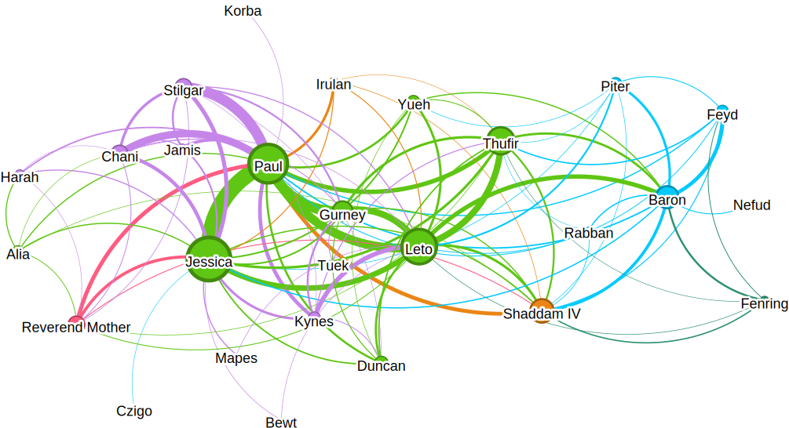

# dune-ner

This project uses the [outlines](https://github.com/dottxt-ai/outlines) library to perform Named Entity Recognition (NER) over the book Dune by Frank Herbert, using structured generation. Our goal is to extract characters, locations, organizations, and hopefully be able to infer clusters from their interaction in the text.

👉 Companion [blog post](https://v4nn4.github.io/posts/playing-with-structured-generation/)

## Results

### Entity Label Graph (outlines + GPT-4o mini)

### Social Graph

